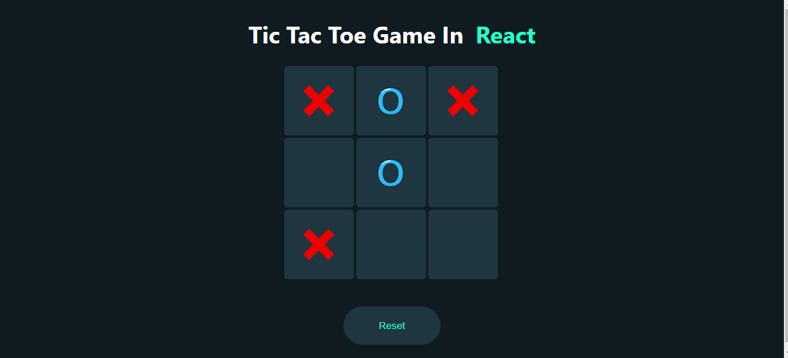

# Tic Tac Toe Game in React

A simple Tic Tac Toe game built using React. This project allows two players to take turns and compete in the classic game of Tic Tac Toe. This was built using this tutorial: [Tic Tac Toe With React Tutorial](https://www.youtube.com/watch?v=lYtPscvwgP4)

## Table of Contents

- [Features](#features)
- [Getting Started](#getting-started)
- [Technologies Used](#technologies-used)
- [Contributing](#contributing)


## Features

- Two players can take turns to play.
- Real-time feedback on who won the game.
- Option to reset the game and start over.
- Stylish user interface with X and O icons.




## Getting Started

To run this project on your local machine, follow these steps:

1. Clone the repository to your local machine:

   ```bash
   git clone https://github.com/your-username/tic-tac-toe-react.git

2. Navigate to the correct directory:

    cd tic-tac-toe

3. Install React:

    npm install react

4. Run a development server to use the application:

    npm start


## Technologies Used

- React: A popular JavaScript library for building user interfaces.
- CSS: Used for styling the user interface.
- JavaScript: The primary programming language used for game logic.

## Project Structure

The project structure is as follows:

- `src/`: Contains the source code for the React application.
  - `components/`: Contains the React components, including the game board and square components.
  - `assets/`: Stores image assets for the X and O symbols.
  - `App.js`: The main application component.
- `public/`: Contains the HTML file and other public assets.

## Contributing

Contributions are welcome! If you'd like to improve the game or fix any issues, please follow these steps:

1. Fork the repository.
2. Create a new branch for your feature or bug fix.
3. Make your changes and test them thoroughly.
4. Create a pull request with a detailed description of your changes.
